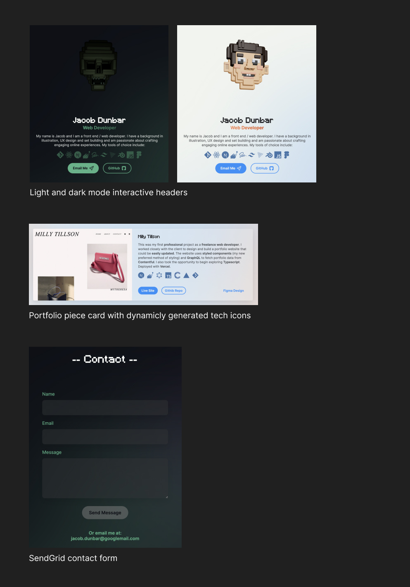

# Jacob Dunbar - Personal portfolio site

A portfolio site to display my top projects and provide easy access to my contact details and CV, whilst conveying a little of my personality too.

## Table of contents

- [Overview](#overview)
  - [About](#about)
  - [Screenshot](#screenshot)
  - [Links](#links)
- [My process](#my-process)
  - [Built with](#built-with)
  - [What I learned](#what-i-learned)
  - [Continued development](#continued-development)
  - [Useful resources](#useful-resources)
- [Author](#author)

## Overview

### About

- The site features an interactive 3D header that looks and behaves differently in light and dark modes. 

- A portfolio section that pulls portfolio projects with GraphQL from Contentful CMS and displays them. Generating tech badges for each technology listed in a JSON provided by Contentful.

- A contact form that uses SendGrid to send emails to my personal email address from the site. 

### Screenshot

### Links

- [Live site](https://jacobdunbar.com)

## My process

### Built with

- Next.js
- Sass
- Strapi CMS
- Heroku
- Contentful CMS
- GraphQL
- Netlify
- Three.js
- React Three Fiber

### What I learned

I originally deployed this site with a separate backend and Strapi CMS hosted by Heroku. However, after Heroku announced the end of their free tier I decided to move over to Contentful. I had just had a really positive experience using Contentful in another project so it was really easy to switch over. I did however learn a lot by using Strapi and Heroku, even if they are no longer used for this site.

I had already had a lot of practice with Sass, but completing a full project using variables, functions and mixins  was a great learning experience and I really enjoy working with sass over vanilla CSS.

This Site uses Three.js and React Three Fiber slightly more intensely that my other projects, due to the interactivity of the models. The light mode character turns to face the user’s cursor on the screen and the dark mode character is lit by a light whose position is also linked to the cursor. There is also a secret behaviour that occurs if the user clicks the character, but wanted to leave that a surprise for anyone who happens to try. This interactivity was challenging but extremely fun. Working with Three.js is definitely something I will continue to do in my free time. 

Learning how to make a contact form was really interesting and I can imagine many circumstances where a feature like this would be useful. 

### Continued development

I feel like my personal site is an opportunity to show a bit of my personality and incorporate some of my additional skills and hobbies. I would like to include more 3D elements, either as Blender 3D illustrations or fully animated and interactive Three.js creations. I am very inspired by the work of [Bruno Simon](https://www.bruno-simon.com) and would love to continue learning about 3D and eventually reach this level. He has a course that I would love to take to further my skills in this area.

### Useful resources

- [Bruno Simon](https://www.bruno-simon.com) - Extremely inspiring work from a master of 3D web development. I think 3D will play an increasingly significant role in web development in the future and would love to be a part of that.
- [Three js, React Three Fiber, React Three Drei Tutorial 2022 | Part 1 | Getting started](https://www.youtube.com/watch?v=y5CAuAZ7kKM&list=PLIRTsuB0iPJvxaYyg8MOrjffPPcYnccL0) - This playlist of six videos from Devving It With Sohail was one of the key resources I used for the 3D header of this site. He delves deeper in these videos than most tutorials on the subject, and really helped me get to grips with some difficult concepts.
- [Contentful Docs](contentful.com/developers/docs/) - Contentful has really great documentation that guided me through the process of setting up the CMS and linking it to my project. I would definitely recommend Contentful to anyone looking for a headless CMS.

## Author

Jacob Dunbar
[jacobdunbar.com](https://www.jacobdunbar.com)
